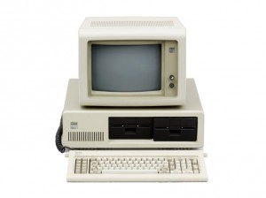
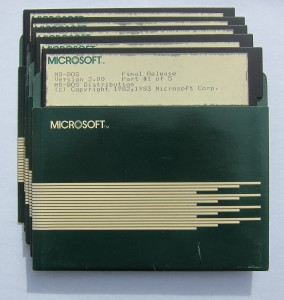
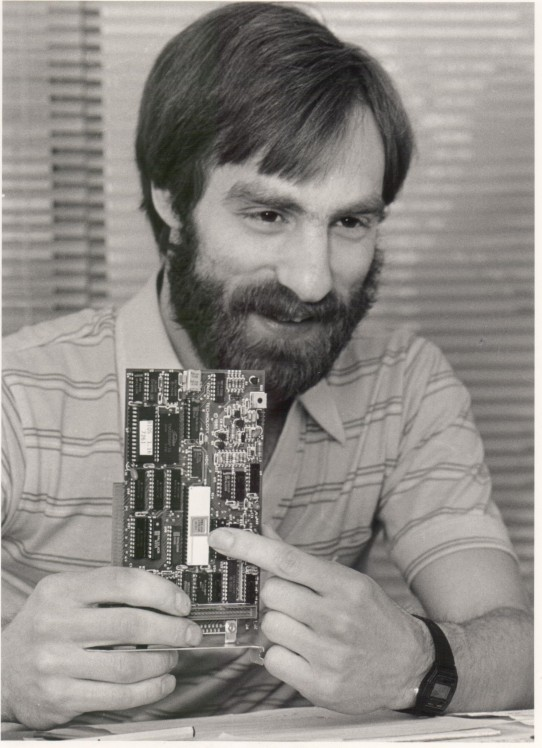
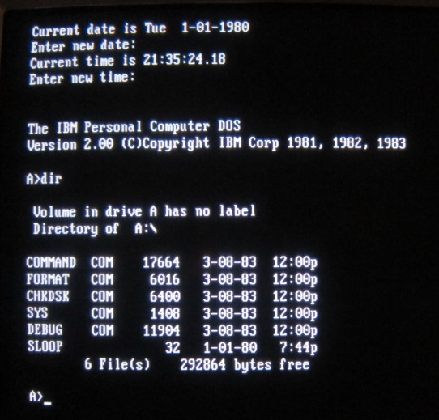

# Microsoft MS-DOS early source code

Original text from: [Microsoft MS-DOS early source code](http://www.computerhistory.org/atchm/microsoft-ms-dos-early-source-code/)

## Software Gems: The Computer History Museum Historical Source Code Series

### IBM did something very unusual for their 1981 personal computer

Rather than using IBM proprietary components developed for their many other computers, the IBM PC used industry standard commercial parts. That included adopting the Intel 8088 microprocessor as the heart of the computer.

This “outsourcing” attitude extended to the software as well. Although IBM had prodigious internal software development resources, for the new PC they supported only operating systems that they did not themselves write, like CP/M-86 from Digital Research in Pacific Grove CA, and the Pascal-based P-System from the University of California in San Diego. But their favored OS was the newly-written PC DOS, commissioned by IBM from the five-year-old Seattle-based software company Microsoft.

When Microsoft signed the contract with IBM in November 1980, they had no such operating system. They too outsourced it, by first licensing then purchasing an operating system from Seattle Computer Products variously called QDOS (Quick and Dirty Operating System”) and 86-DOS.

PC DOS version 1.0, which supported only floppy disks, was shipped when IBM first released their PC in August 1981. Microsoft then substantially rewrote the software to support subdirectories and hard disks; version 2.0 was released with the IBM PC-XT in March of 1983.

Microsoft retained the rights to the operating system and licensed it to other computer manufacturers, calling it MS-DOS. With the permission of Microsoft Corporation, the Computer History Museum is pleased to make available the source and object code to Microsoft’s MS-DOS operating system versions 1.1 and 2.0, for non-commercial use.

The zip file contains four subdirectories:

* v11source: 7 assembler code files, and an explanatory email from Tim Paterson
* v11object: 27 files, some binary programs and some sample programs
* v20source: 118 text files, mostly assembler code and some documentation
* v20object: 38 files, some binary and some documentation
 

To access this material, you must agree to the terms of the license displayed here, which permits only non-commercial use and does not give you the right to license it to third parties by posting copies elsewhere on the web.

Download Microsoft DOS V1.1 and V2.0 Source Code

Other historical source code releases in this series include IBM’s APL programming language, Apple II DOS, Adobe’s Photoshop, Apple Macpaint/QuickDraw, and Microsoft’s Word for Windows.  If you would like us to do more of this, please consider supporting the museum’s efforts by making a donation. We are a 501(c)3 non-profit organization.

## More about the origins of MS-DOS

### Starting from scratch: NOT
 
The most popular operating system for small microcomputers in the late 1970s was CP/M, written by Gary Kildall in about 1974 and marketed by the company he started, Digital Research, Inc.  IBM visited Digital Research in August 1980  – some say at the suggestion of Bill Gates – to investigate using “CP/M-86″, their upcoming version for the 16-bit Intel 8088/8086 processor, on the IBM PC then under development. But they were not able to agree on licensing terms, so IBM left and pursued other options.

_Tim Paterson in 1986_

IBM had already contracted with Microsoft to provide a BASIC interpreter for the PC, so they asked them to investigate also providing the operating system. Microsoft proposed licensing “86-DOS”, which had been written by Tim Paterson at Seattle Computer Products (SCP) for their 8086-based computer kit because the 16-bit version of CP/M was late.

When SCP signed the licensing deal  [7] with Microsoft, they didn’t know for sure who the computer manufacturer was. Paterson said “We all had our suspicions that it was IBM that Microsoft was dealing with, but we didn’t know for sure.” [1]  He left SCP to work for Microsoft in 1981. “The first day on the job I walk through the door and ‘Hey! It’s IBM.’”

Microsoft originally licensed 86-DOS in December 1980 for a flat fee of $25,000. By the next summer they recognized the importance of owning it and being able to license it to other companies making IBM-PC clones, so they purchased all rights for an additional $50,000.

Over the next 11 months Paterson worked for Microsoft, interacting intensely with the IBM engineers developing the PC in Boca Raton, Florida. Version 1.0 of PC-DOS was complete in July 1981, one month before the announcement of the IBM PC.

SCP later sued Microsoft, claiming that they had concealed its relationship with IBM in order to purchase the operating system cheaply. SCP ultimately settled out of court for almost $1M.

## MS-DOS ≠ CP/M

There were many similarities between CP/M and MS-DOS. Inspired by the 8-bit CP/M, Paterson’s 16-bit operating system used similar commands and some of the same programming interfaces, but it was a different internal implementation and used different file storage formats.

At Digital Research, Gary Kildall’s opinion was that MS-DOS infringed on their copyrights for CP/M. He was furious, and confronted both Bill Gates at Microsoft and IBM, but his lawyer recommended against a lawsuit.  ”Rather than sue, Kildall agreed to license CP/M to Big Blue. But he was astounded that when the PC was released, IBM charged $240 per copy for CP/M, and only $40 for DOS.” [3] Needless to say, the Microsoft offering became the dominant operating system for the IBM PC.

Paterson denied any wrongdoing. “I told him [Kildall] I didn’t copy anything. I just took his printed documentation and did something that did the same thing.” [5]

Thirty years later, Bob Zeidman, a programmer and expert in software intellectual property cases, conducted a detailed forensic examination of the code of QDOS, CP/M and PC-DOS. His conclusion? “QDOS was absolutely not copied from CP/M, and MS-DOS showed no signs of copying either. Kildall’s accusations about Bill Gates were totally groundless.” [4]

## From PC-DOS 1.0 to MS-DOS 2.0 and beyond

Version 1.0 of PC-DOS was released with the first IBM PC in August 1981. Version 1.1, which supported double-sided (320 KB) floppy disk drives, was released in May of 1982.

In the meantime, a team of Microsoft programmers that included company co-founder Paul Allen was working on a major revision to add hierarchical subdirectories, and to support the hard disks that would be available on the IBM PC-XT. DOS 2.0 was almost twice as big as DOS 1.0, using 28 Kbytes of memory instead of 12 Kbytes. It shipped in March 1983 with the PC-XT as PC-DOS 2.0, and was released to other computer manufacturers as MS-DOS 2.0.

MS-DOS continued to be enhanced until the late 1990s, by which time Windows and other advanced operating systems with graphical user interfaces had taken over.

## What early versions MS-DOS did

An operating system that fits in 12 or 28 Kbytes of memory is very different from the large and complex operating systems we use today.

MS-DOS was basically a file manager and a simple program loader. The user interface was text commands typed on a keyboard, followed by text responses displayed on the screen. There was no graphical output, and no mouse for input. Only one user application program could run at a time. File names were limited to 8 characters, plus a 3-character extension indicating the file type. There were commands like “dir” to list the files in a directory, and “del” to delete a file; you ran a program by typing the name of its executable file.

In addition to adding hierarchical directories and hard disk support, the rewritten version 2.0 included many other new features: installable device drivers to support the growing list of available peripheral devices such as printers, background processes (“terminate-and-stay-resident”) that allowed print spooling, redirection that allowed the output of one program to be the input to another, and support for 9-sector floppy disks that increased capacity from 320 KB to 360 KB.

Despite its primitive facilities, for fifteen years DOS was the bedrock upon which thousands of application programs running on millions of IBM PCs and PC clones depended.

## Acknowledgements

I had the source code for version 2.0 on 5″ floppy disks in my attic for 30 years, but we needed Microsoft’s permission to release it. We are very grateful to Roy Levin, Managing Director of Microsoft Research, Silicon Valley, for working many months to make that happen.

But I didn’t have the source to the earlier version 1.1, and neither, apparently, did Microsoft. Just as I was finishing the first draft of this article, I received it directly from the author, Tim Paterson! We are grateful to Tim for sending it, and to Roy for quickly getting the additional permission needed to release it as well.

## References

[1] “The Roots of DOS: Tim Paterson”, by David Hunter, Softalk, March 1983, available at [http://www.patersontech.com/dos/softalk.aspx](http://www.patersontech.com/dos/softalk.aspx)

[2] Gordon Eubanks Oral History, Computerworld Honors Program International Archives, November 8, 2000, [http://www.cwhonors.org/archives/histories/Eubanks.pdf](http://www.cwhonors.org/archives/histories/Eubanks.pdf)

[3] “The Man Who Could Have Been Bill Gates”, Business Week, October 24, 2004, [http://www.businessweek.com/stories/2004-10-24/the-man-who-could-have-been-bill-gates](http://www.businessweek.com/stories/2004-10-24/the-man-who-could-have-been-bill-gates)

[4] “Did Bill Gates Steal the Heart of DOS?”, by Bob Zeidman, IEEE Spectrum, July 31, 2012, [http://spectrum.ieee.org/computing/software/did-bill-gates-steal-the-heart-of-dos](http://spectrum.ieee.org/computing/software/did-bill-gates-steal-the-heart-of-dos)

[5] “Hard Drive”, by James Wallace and Jim Erickson, John Wiley & Sons, 1992

[6] “The MS-DOS Encyclopedia”, Microsoft Press, 1988

[7] License agreement for 86-DOS between Seattle Computer Products and Microsoft, dated January 6, 1981, published as part of the Comes v. Microsoft lawsuit proceedings. [Microsoft_SCP_agreement](http://www.computerhistory.org/atchm/?attachment_id=4269)